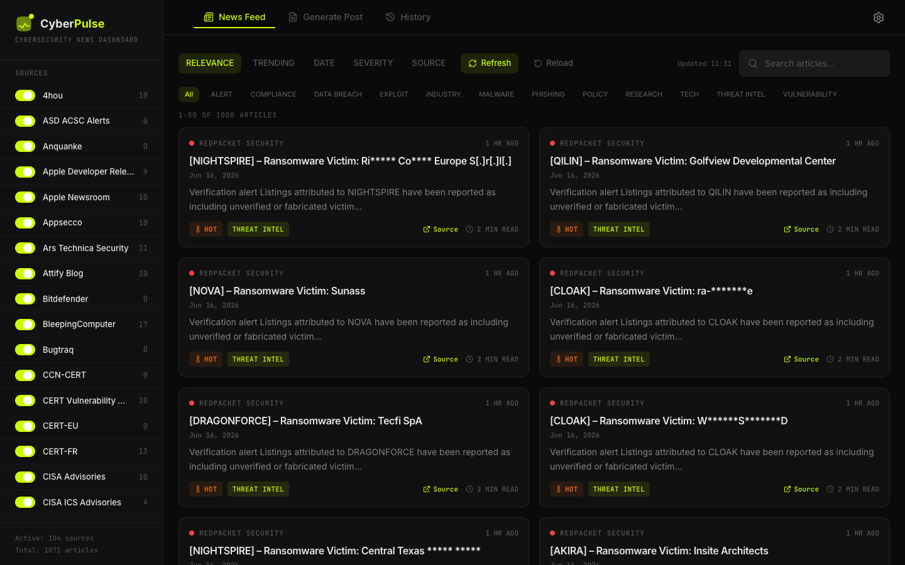
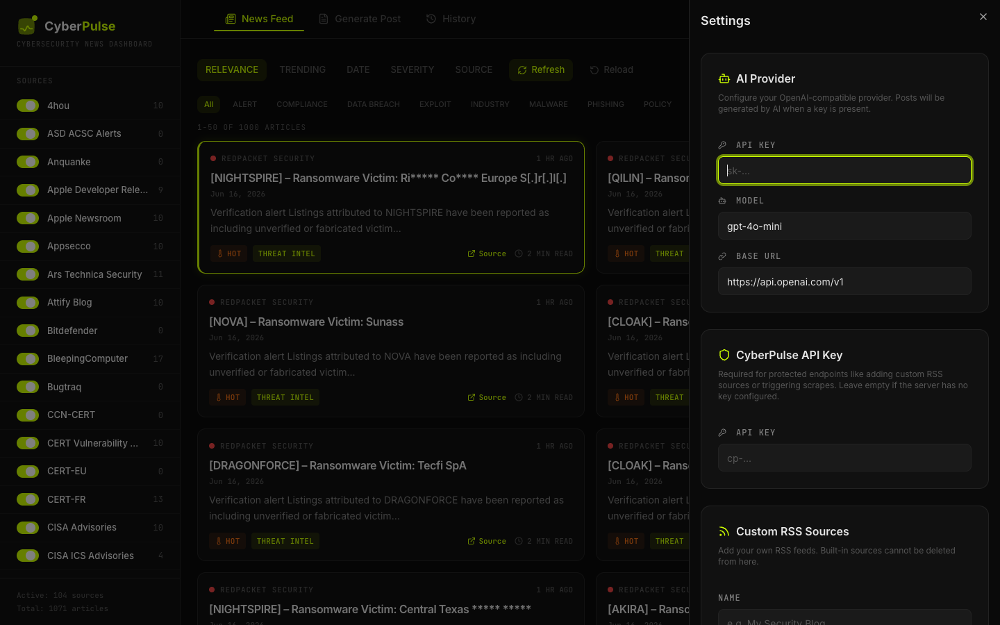
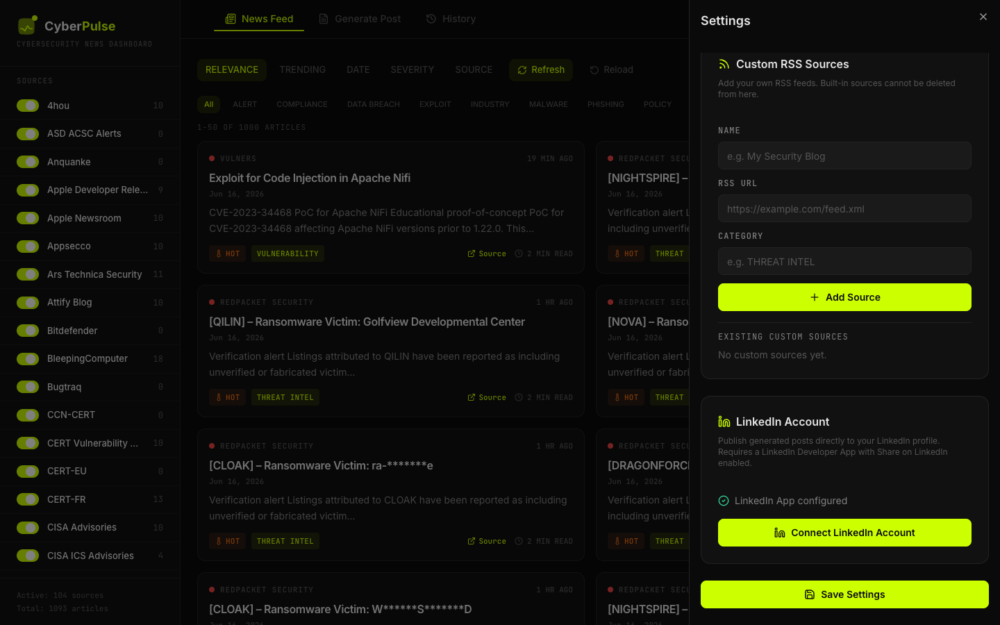
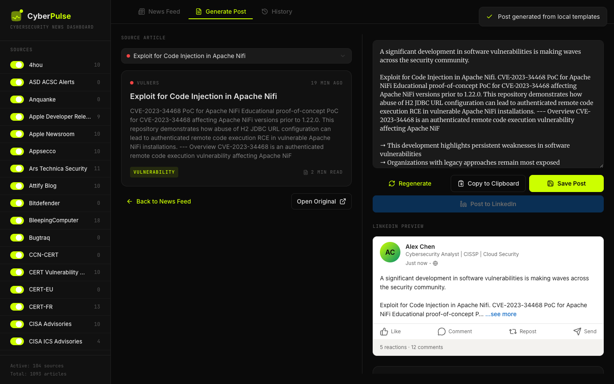
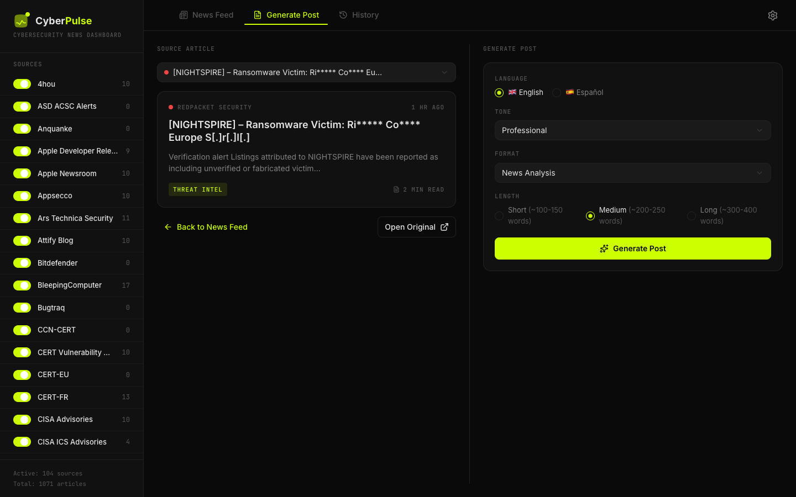
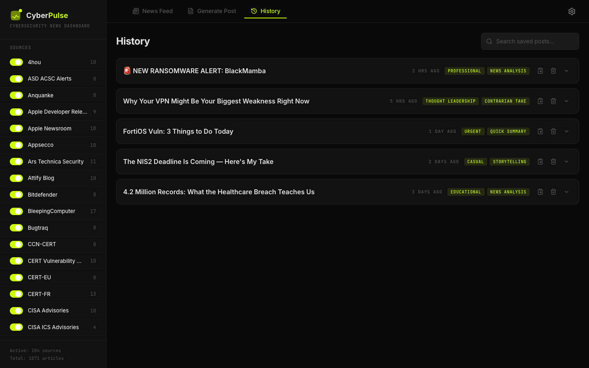
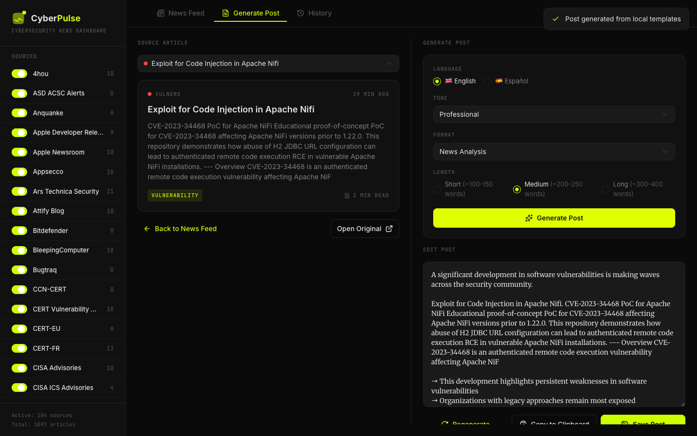

<div align="center" style="background-color:#0a0a0a; color:#e5e5e5; padding: 2rem 1rem; border-radius: 12px;">

<p align="center">
  
</p>

<h1 align="center">CyberPulse</h1>

<p align="center">
  <strong>Agregador de noticias de ciberseguridad con generador de posts para LinkedIn.</strong><br>
  Consume más de 100 fuentes RSS, clasifica artículos por severidad/categoría y genera contenido listo para publicar.
</p>

<p align="center">
  <a href="README.md">🇬🇧 Read in English</a>
</p>

<p align="center">
  
  
  
  
</p>

</div>

---

## Índice

- [¿Qué hace CyberPulse?](#qué-hace-cyberpulse)
- [Features](#features)
- [Quick start con Docker](#quick-start-con-docker)
- [Uso sin Docker](#uso-sin-docker)
- [Cómo agregar fuentes RSS](#cómo-agregar-fuentes-rss)
- [Publicar directamente en LinkedIn](#publicar-directamente-en-linkedin)
- [Fuentes RSS incluidas](#fuentes-rss-incluidas-104-fuentes)
- [Estructura del repositorio](#estructura-del-repositorio)
- [Documentación adicional](#documentación-adicional)
- [Capturas de pantalla](#capturas-de-pantalla)
- [Licencia](#licencia)

---

## ¿Qué hace CyberPulse?

CyberPulse es una herramienta productiva para profesionales de ciberseguridad que necesitan estar al día y compartir contenido relevante en LinkedIn.

<p align="center">
  
</p>

- **Recopila** noticias de más de 100 fuentes RSS de ciberseguridad.
- **Clasifica** cada artículo por categoría (`VULNERABILITY`, `MALWARE`, `THREAT INTEL`, etc.) y severidad (`critical`, `high`, `medium`, `low`).
- **Genera posts** para LinkedIn en varios formatos y tonos, con negritas reales (HTML).
- **Publica directamente en LinkedIn** desde el generador tras la autorización OAuth.
- **Soporta IA**: conecta tu proveedor OpenAI-compatible (OpenAI, Groq, etc.) para generar posts personalizados; si falla, usa plantillas locales.
- **Expone una API REST y un endpoint MCP** para integrarlo con agentes de IA como Hermes u OpenClaw.
- **Funciona 100 % local** con SQLite y Docker.

---

## Features

- 📰 **Más de 100 fuentes RSS** activas por defecto.
- 🔥 **Feed de noticias** con filtros por categoría, fuente, búsqueda y ordenamiento por fecha, severidad o *trending*.
- ✍️ **Generador de posts** con 5 tonos, 6 formatos y soporte EN/ES.
- 🚀 **Publicación directa en LinkedIn** desde el generador.
- 🕐 **Historial / posts guardados** para retener tu contenido generado.
- 🤖 **Generación con IA** configurable desde la UI (API key, modelo, base URL).
- ⚙️ **Fuentes RSS personalizadas** desde la interfaz web.
- 🔑 **API key opcional** para proteger endpoints sensibles.
- 🐳 **Deploy con Docker** en un solo comando.
- 📊 **Estadísticas, health checks y logs** integrados.

---

## Quick start con Docker

```bash
git clone https://github.com/safernandez666/CyberPulse.git
cd CyberPulse/app
docker compose up -d --build
```

Abre http://localhost:3001 en tu navegador.

> Si acabas de reconstruir, usa **Ctrl + F5** o una ventana de incógnito para evitar que el navegador muestre la versión anterior del frontend.

Comandos útiles:

```bash
# Ver estado
docker compose ps

# Ver logs
docker compose logs -f

# Forzar scraping manual
curl -X POST http://localhost:3001/api/scrape

# Ver fuentes activas
curl http://localhost:3001/api/sources

# Detener
docker compose down
```

---

## Uso sin Docker

Requisitos: Node.js 20+ y npm 10+.

```bash
cd CyberPulse/app
npm install
npm run build
npm run server
```

- App: http://localhost:3001
- La base de datos SQLite se crea en `./data/cyberpulse.db`.

---

## Cómo agregar fuentes RSS

Hay tres formas de agregar una nueva fuente.

### Opción 1: Desde la interfaz web (recomendado)

<p align="center">
  
</p>

1. Abre CyberPulse y haz clic en **Configuración** (icono de engranaje).
2. Ve a la sección **Fuentes RSS personalizadas**.
3. Completa:
   - **Nombre**: el nombre visible de la fuente.
   - **URL del feed RSS**: ej. `https://mi-fuente.com/feed.xml`.
   - **Categoría**: una de las categorías existentes (ver lista más abajo).
4. Haz clic en **Agregar fuente**.
5. Opcionalmente, introduce la **CyberPulse API Key** si protegiste el backend con `CYBERPULSE_API_KEY`.

La nueva fuente se scrapea en el próximo ciclo automático (cada 15 minutos) o puedes forzarlo:

```bash
curl -X POST http://localhost:3001/api/scrape
```

### Opción 2: Mediante la API REST

```bash
# Sin API key configurada
curl -X POST http://localhost:3001/api/sources \
  -H "Content-Type: application/json" \
  -d '{
    "name": "Mi Nueva Fuente",
    "rssUrl": "https://mi-fuente.com/feed.xml",
    "category": "THREAT INTEL"
  }'

# Con API key configurada
curl -X POST http://localhost:3001/api/sources \
  -H "Content-Type: application/json" \
  -H "X-API-Key: tu-clave-secreta" \
  -d '{
    "name": "Mi Nueva Fuente",
    "rssUrl": "https://mi-fuente.com/feed.xml",
    "category": "THREAT INTEL"
  }'
```

### Opción 3: Editar el código

1. Abre `app/server/seeds.ts`.
2. Agrega una entrada al array `RSS_SOURCES`:

```typescript
{
  name: 'Mi Nueva Fuente',
  rssUrl: 'https://mi-fuente.com/feed.xml',
  category: 'THREAT INTEL'
}
```

3. Reconstruye el contenedor:

```bash
docker compose down
docker compose up -d --build
```

### Categorías disponibles

| Categoría | Uso típico |
|-----------|------------|
| `VULNERABILITY` | Vulnerabilidades, parches, advisories |
| `MALWARE` | Malware, ransomware, análisis de muestras |
| `THREAT INTEL` | Inteligencia de amenazas, reportes de actores |
| `DATA BREACH` | Filtraciones de datos, breaches |
| `PHISHING` | Campañas de phishing, engaños |
| `COMPLIANCE` | Cumplimiento normativo |
| `RESEARCH` | Investigación de seguridad |
| `PRIVACY` | Privacidad |
| `POLICY` | Políticas gubernamentales |
| `INDUSTRY` | Noticias de la industria |
| `ALERT` | Alertas de CERT/CISA/NCSC |
| `AWARENESS` | Concientización |
| `EXPLOIT` | Exploits, PoC, zero-days |
| `IOT` | Seguridad IoT |
| `TECH` | Tecnología general relevante |

---

## Publicar directamente en LinkedIn

CyberPulse puede publicar posts generados directamente en tu feed personal de LinkedIn. Usa la API oficial de LinkedIn con OAuth 2.0, así que vos mantenés el control total de tu cuenta.

<p align="center">
  
</p>

### 1. Crear una LinkedIn Developer App

1. Andá al [LinkedIn Developer Portal](https://developer.linkedin.com/) y hacé clic en **Create app**.
2. Completá los datos requeridos:
   - **App name**: ej. `CyberPulse`
   - **LinkedIn Page**: tenés que asociar una página de empresa de LinkedIn. Si no tenés una, creá una mínima.
   - **Privacy policy URL**: tu sitio web o perfil de LinkedIn.
3. En la pestaña **Products**, solicitá:
   - **Share on LinkedIn** — aprobación inmediata.
   - **Sign In with LinkedIn using OpenID Connect** — aprobación inmediata.
4. Andá a la pestaña **Auth**:
   - Copiá tu **Client ID** y **Client Secret**.
   - En **OAuth 2.0 settings**, agregá esta URL de redirección:
     ```
     http://localhost:3001/api/linkedin/callback
     ```

### 2. Configurar CyberPulse

1. Abrí CyberPulse y hacé clic en **Configuración**.
2. Desplazate hasta la sección **LinkedIn Account**.
3. Pegá tu **Client ID**, **Client Secret** y la redirect URI (`http://localhost:3001/api/linkedin/callback`).
4. Hacé clic en **Save LinkedIn App**.

### 3. Conectar tu cuenta

1. En la misma sección de LinkedIn Account, hacé clic en **Connect LinkedIn Account**.
2. Autorizá a CyberPulse en el popup de LinkedIn.
3. Cuando veas "LinkedIn Connected", podés cerrar el popup.

### 4. Publicar un post

1. Andá a **Generate Post**, elegí un artículo y generá tu publicación.
2. Hacé clic en **Post to LinkedIn**.
3. Revisá el texto, elegí **Public** o **Connections** y hacé clic en **Publish**.

<p align="center">
  
</p>

> **Nota:** los tokens de acceso de LinkedIn expiran aproximadamente a los 60 días. Si deja de funcionar la publicación, reconectá tu cuenta desde Configuración.

---

## Fuentes RSS incluidas (104 fuentes)

CyberPulse viene configurado con más de 100 fuentes de ciberseguridad. Algunas pueden fallar ocasionalmente por problemas de red, bloqueos o feeds desactualizados, pero las fuentes funcionales se mantienen activas.

### ALERT

| Fuente | RSS URL |
|--------|---------|
| ASD ACSC Alerts | https://www.cyber.gov.au/rss/alerts |
| CERT-EU | https://cert.europa.eu/publications/newsletter%20RSS |
| CERT-FR | https://www.cert.ssi.gouv.fr/feed/ |
| INCIBE | https://www.incibe.es/feed/alertas-tempranas |
| JPCERT/CC | https://www.jpcert.or.jp/english/rss/jpcert-en.rdf |
| JPCERT/CC Blog | https://blogs.jpcert.or.jp/en/atom.xml |
| UK NCSC All | https://www.ncsc.gov.uk/api/1/services/v1/all-rss-feed.xml |
| UK NCSC News | https://www.ncsc.gov.uk/api/1/services/v1/news-rss-feed.xml |
| UK NCSC Reports | https://www.ncsc.gov.uk/api/1/services/v1/report-rss-feed.xml |

### AWARENESS

| Fuente | RSS URL |
|--------|---------|
| OSI | https://www.osi.es/feed/actualidad |

### COMPLIANCE

| Fuente | RSS URL |
|--------|---------|
| Dark Reading | https://www.darkreading.com/rss.xml |

### DATA BREACH

| Fuente | RSS URL |
|--------|---------|
| The Record | https://therecord.media/feed/ |
| Troy Hunt | https://www.troyhunt.com/rss/ |

### EXPLOIT

| Fuente | RSS URL |
|--------|---------|
| Exploit-DB | https://www.exploit-db.com/rss.xml |
| Packet Storm | https://rss.packetstormsecurity.com/files/ |
| Sploitus | https://sploitus.com/rss |
| ZDI Blog | https://www.zerodayinitiative.com/blog?format=rss |
| ZDI Published | https://www.zerodayinitiative.com/rss/published/ |

### INDUSTRY

| Fuente | RSS URL |
|--------|---------|
| Cybersecurity Dive | https://www.cybersecuritydive.com/feeds/news/ |
| Infosecurity Magazine | http://www.infosecurity-magazine.com/rss/news/ |
| Security Boulevard | https://securityboulevard.com/feed/ |

### IOT

| Fuente | RSS URL |
|--------|---------|
| Attify Blog | https://blog.attify.com/rss/ |

### MALWARE

| Fuente | RSS URL |
|--------|---------|
| Bitdefender | https://www.bitdefender.com/blog/hotforsecurity/feed/ |
| Elastic Security Labs | https://www.elastic.co/security-labs/rss/feed.xml |
| Kaspersky Blog | https://www.kaspersky.com/blog/feed/ |
| Malwarebytes Labs | https://blog.malwarebytes.com/feed/ |
| Securelist | https://securelist.com/feed/ |
| SecurityWeek | https://feeds.feedburner.com/securityweek |
| SentinelOne | https://www.sentinelone.com/feed/ |
| Sophos News | https://news.sophos.com/en-us/feed/ |
| WeLiveSecurity | https://www.welivesecurity.com/en/rss/feed/ |

### PHISHING

| Fuente | RSS URL |
|--------|---------|
| Krebs on Security | https://krebsonsecurity.com/feed/ |

### POLICY

| Fuente | RSS URL |
|--------|---------|
| CyberScoop | https://cyberscoop.com/feed |
| ENISA | https://www.enisa.europa.eu/rss/publications |
| NSA Cybersecurity | https://www.nsa.gov/Press-Room/Press-Releases-Statements/feed/ |

### RESEARCH

| Fuente | RSS URL |
|--------|---------|
| Ars Technica Security | https://arstechnica.com/security/feed/ |
| Google Online Security | https://feeds.feedburner.com/GoogleOnlineSecurityBlog |
| Google Project Zero | https://googleprojectzero.blogspot.com/feeds/posts/default?alt=rss |
| Google TAG | https://blog.google/threat-analysis-group/rss/ |
| InfoSec Write-ups | https://infosecwriteups.com/feed |
| STAR Labs | https://starlabs.sg/publications/index.xml |
| Tencent Xuanwu Lab | https://xlab.tencent.com/cn/feed/ |
| Trail of Bits | https://blog.trailofbits.com/feed/ |
| paper - Last paper | https://paper.seebug.org/rss/ |
| tttang | https://www.tttang.com/rss.xml |

### TECH

| Fuente | RSS URL |
|--------|---------|
| Hacker News Frontpage | https://hnrss.org/frontpage |

### THREAT INTEL

| Fuente | RSS URL |
|--------|---------|
| 4hou | https://www.4hou.com/feed |
| Anquanke | https://api.anquanke.com/data/v1/rss |
| Check Point Blog | https://blog.checkpoint.com/feed/ |
| Check Point Research | https://research.checkpoint.com/feed/ |
| Cisco Talos | https://feeds.feedburner.com/feedburner/Talos |
| CrowdStrike Blog | https://www.crowdstrike.com/blog/feed/ |
| Cyber Kendra | https://www.cyberkendra.com/feeds/posts/default |
| CyberNews | https://cybernews.com/feed/ |
| Cybersecurity News | https://securityonline.info/feed/ |
| Darknet | http://feeds.feedburner.com/darknethackers |
| FBI Cyber | https://www.fbi.gov/news/feed |
| HackerNews.cc | http://hackernews.cc/feed |
| Intelligence Online | https://feeds.feedburner.com/IntelligenceOnline |
| Mandiant | https://www.mandiant.com/resources/blog/rss.xml |
| Palo Alto Networks | https://www.paloaltonetworks.com/blog/feed |
| Proofpoint Threat Insight | https://www.proofpoint.com/us/threat-insight-blog.xml |
| RedPacket Security | https://www.redpacketsecurity.com/feed/ |
| Risky Business | https://risky.biz/rss.xml |
| SANS ISC | https://isc.sans.edu/rssfeed.xml |
| SANS ISC Full | https://isc.sans.edu/rssfeed_full.xml |
| Schneier on Security | https://www.schneier.com/feed/atom/ |
| The DFIR Report | https://thedfirreport.com/feed/ |
| The Hacker News | https://feeds.feedburner.com/TheHackersNews |
| Threatpost | https://threatpost.com/feed/ |

### VULNERABILITY

| Fuente | RSS URL |
|--------|---------|
| Apple Developer Releases | https://developer.apple.com/news/releases/rss/releases.rss |
| Apple Newsroom | https://www.apple.com/newsroom/rss-feed.rss |
| Appsecco | https://blog.appsecco.com/feed |
| BleepingComputer | https://www.bleepingcomputer.com/feed/ |
| Bugtraq | http://seclists.org/rss/bugtraq.rss |
| CCN-CERT | https://www.ccn-cert.cni.es/feed/avisos |
| CERT Vulnerability Notes | http://www.kb.cert.org/vulfeed |
| CISA Advisories | https://www.cisa.gov/cybersecurity-advisories/all.xml |
| CISA ICS Advisories | https://www.cisa.gov/cybersecurity-advisories/ics-advisories.xml |
| CISA ICS Medical Advisories | https://www.cisa.gov/cybersecurity-advisories/ics-medical-advisories.xml |
| CVEfeed.io | https://cvefeed.io/rssfeed/latest.xml |
| CXSecurity | https://cxsecurity.com/wlb/rss/all/ |
| Cisco Security Blog | https://blogs.cisco.com/security/feed |
| Der Flounder | https://derflounder.wordpress.com/feed/ |
| FortiGuard PSIRT | https://www.fortiguard.com/rss/ir.xml |
| Fortinet Blog | https://www.fortinet.com/blog/feed |
| HackerOne Hacktivity | https://rss.ricterz.me/hacktivity |
| Intigriti | https://blog.intigriti.com/feed/ |
| Microsoft Security | https://www.microsoft.com/en-us/security/blog/feed/ |
| Microsoft Security Update Guide | https://api.msrc.microsoft.com/update-guide/rss |
| NSFocus | http://blog.nsfocus.net/feed/ |
| Palo Alto Security Advisories | https://security.paloaltonetworks.com/rss.xml |
| Pen Test Partners | https://www.pentestpartners.com/feed/ |
| PortSwigger Blog | https://portswigger.net/blog/rss |
| Praetorian | https://www.praetorian.com/blog/feed |
| Qualys Blog | https://blog.qualys.com/feed |
| Rapid7 Blog | https://blog.rapid7.com/rss/ |
| Rapid7 Emergent Threats | https://blog.rapid7.com/tag/emergent-threat-response/rss/ |
| RedesZone | https://www.redeszone.net/feed/ |
| Seebug | https://www.seebug.org/rss/new/ |
| Tenable Blog | https://www.tenable.com/blog/feed |
| Trickest CVE | https://github.com/trickest/cve/commits/main.atom |
| VulDB | https://vuldb.com/en/?rss.recent |
| Vulners | https://vulners.com/rss.xml |

---

## Estructura del repositorio

```
CyberPulse/
├── app/                  # Aplicación principal (React + Express + SQLite)
│   ├── src/              # Frontend
│   ├── server/           # Backend y scraper
│   ├── public/           # Logo y assets estáticos
│   ├── docker-compose.yml
│   ├── Dockerfile
│   ├── API.md            # Documentación completa de la API
│   └── DOCKER.md         # Guía detallada de Docker
├── vscode-extension/     # Extensión de VS Code para CyberPulse
├── research/             # Documentación de arquitectura y estrategia de contenido
└── README.md             # Versión en inglés
```

---

## Capturas de pantalla

Algunas capturas de CyberPulse en acción. Haz clic en cualquier imagen para verla en tamaño completo.

| News Feed | Generate Post | History | Settings |
|-----------|---------------|---------|----------|
| <a href=".github/screenshots/01-news-feed.png"></a> | <a href=".github/screenshots/02-generate-post.png"></a> | <a href=".github/screenshots/03-history.png"></a> | <a href=".github/screenshots/04-settings.png"></a> |

| LinkedIn Settings | LinkedIn Button | LinkedIn Publish |
|-------------------|-----------------|------------------|
| <a href=".github/screenshots/05-linkedin-settings.png"></a> | <a href=".github/screenshots/06-linkedin-button.png"></a> | <a href=".github/screenshots/07-linkedin-publish-dialog.png"></a> |

---

## Documentación adicional

- [`app/API.md`](app/API.md) – Endpoints REST y MCP completos.
- [`app/DOCKER.md`](app/DOCKER.md) – Guía avanzada de Docker.

---

## Variables de entorno

| Variable | Default | Descripción |
|----------|---------|-------------|
| `PORT` | `3001` | Puerto del servidor |
| `CYBERPULSE_API_KEY` | `null` | API key opcional para proteger endpoints sensibles |
| `LINKEDIN_CLIENT_ID` | `null` | Client ID de la LinkedIn Developer App (opcional — también se puede configurar en la GUI) |
| `LINKEDIN_CLIENT_SECRET` | `null` | Client Secret de la LinkedIn Developer App (opcional — también se puede configurar en la GUI) |
| `LINKEDIN_REDIRECT_URI` | `http://localhost:3001/api/linkedin/callback` | URI de redirección de OAuth de LinkedIn |
| `SCRAPE_CRON` | `*/15 * * * *` | Intervalo de scraping RSS |
| `NODE_ENV` | `production` | Entorno de Node |

---

## Licencia

MIT © Santiago Fernández
